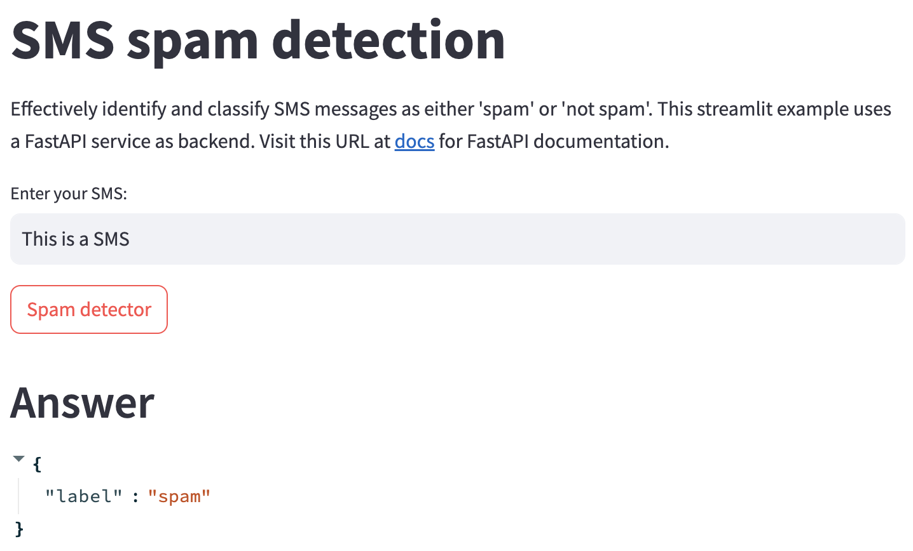

# NLP technical challenge
Develop a software solution that can effectively identify and classify SMS messages as either `spam`
or `not spam`. 
This involves creating a machine learning model or algorithm that can analyze the content of an SMS
message and make a prediction based on its understanding of what constitutes spam. 
The solution should be able to learn from a dataset of SMS messages that have been pre-classified 
as 'spam' or 'not spam', and apply this learning to new, unseen messages. 
The ultimate goal is to reduce the amount of spam messages that reach users' inboxes by accurately 
identifying and filtering out spam.

Example:

● **Input:**

"Subject: flow volumes at oxy gladewater , meter 98926
bob ,
i have a volume of about 713 / day at the above referenced meter . i don ' t
have a deal in the system to allocate to for october ( flow began on 10 / 11 ) .
this is hitting my exception report . please advise .
mary "

● **Output:** 

"not spam"


## Services

This repository exposes 3 components :
- A container `python` running Jupyter Lab notebooks (available @ localhost:8888).  Any notebooks will persist in a mounted volume (./volumes/notebooks)
- A container `fastapi` running FastAPI to serve predictions from a scikit-learn / HF model (available @ localhost:8080)
- A container `streamlit` running Streamlit allows a user to access the predictions from their model based on user inputs (available at localhost:8501)


## Usage

turn on the application 
```
docker-compose up 
```

turn off the application
```
docker-compose down
```

rebuild the application
```
docker-compose up --build
```


## Structure

```
|-- containers - code
|   |-- python      # interactive jupyter notebooks
|   |-- fastapi     # deploy joblib model format as a REST API 
|   |-- streamlit   # access REST API in a user interface 
|-- volumes         # persistent data
|   |-- notebooks   # jupyter notebooks / persisted here
|   |-- static      # csv files / joblib models format loaded into jupyter
```

## Package Manager

Use `pipenv` environments in each container.


## Streamlit User Interface

Enter a SMS, and it will tell you if it is a spam or not:
  


## Use another model for inference

- You can set your model path in `containers/fastapi/app/conf.py`
- You can store your model in the Volume `volumes/static/models/`
- All models must be `joblib` format


## Ideas for improving the project
- Train a LLM model on a larger dataset by leveraging GPUs.
- Fine tune a LLM model with RLHF
- Use Quantization technics to make the model smaller and more scalable
- Use a dedicated inference endpoint specific to LLM